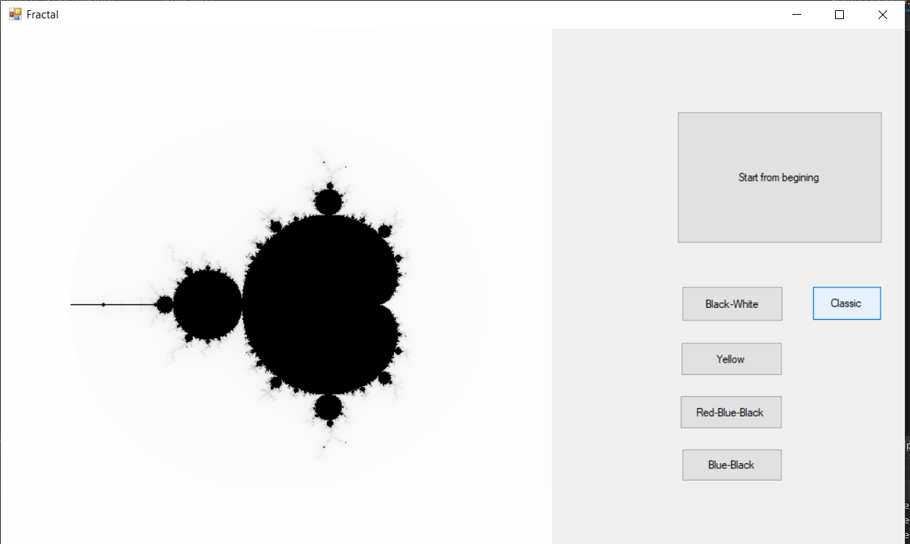
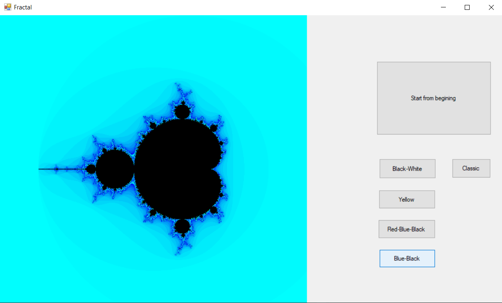
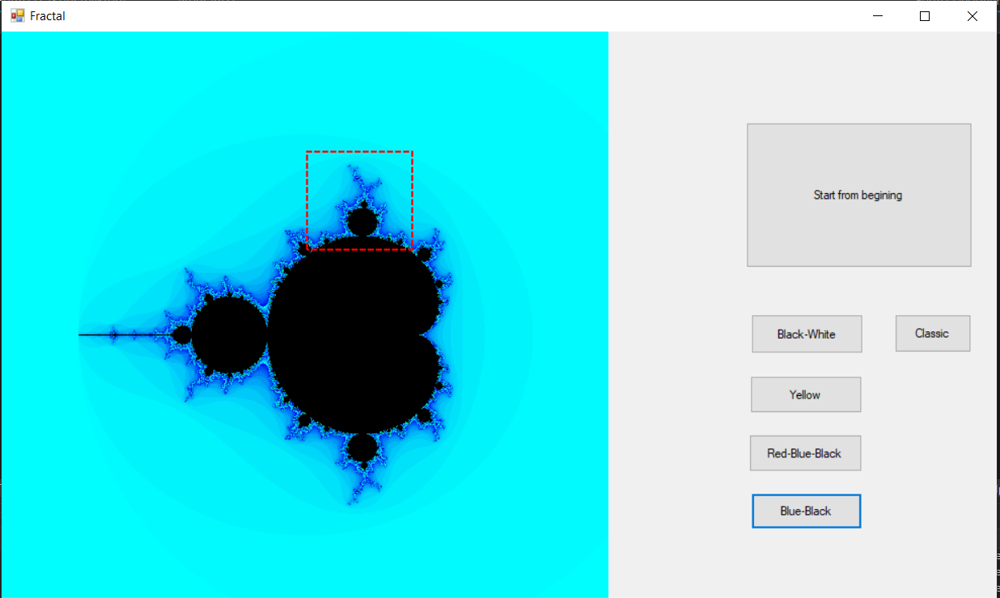

Приложение с отображением фрактала мондельброта
================================================
Проект написан на C# на основе Windows Form, отображает фрактал в различных цветах(цвета написаны на кнопках)

Так же имеется возможность выделить область на фрактале для ее увеличения, откат на началную картинку по кнопке старта.(Имеются проблемы с увеличением выделенноц области, если она сильно отличается от квадрата из-за пропорций и масштаба)

